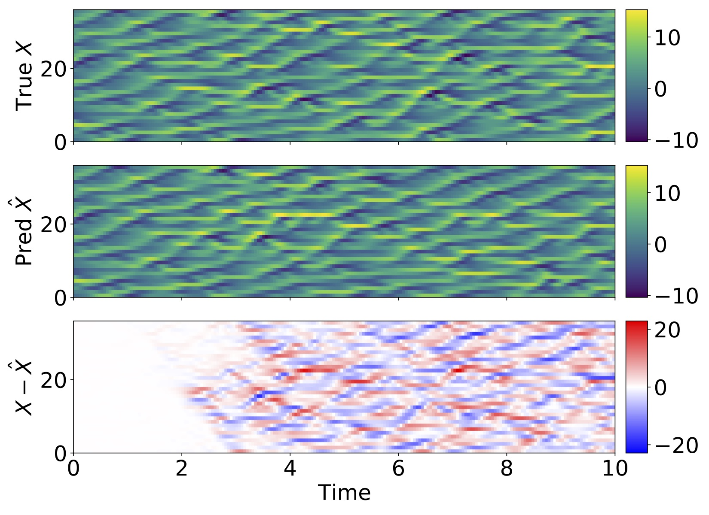
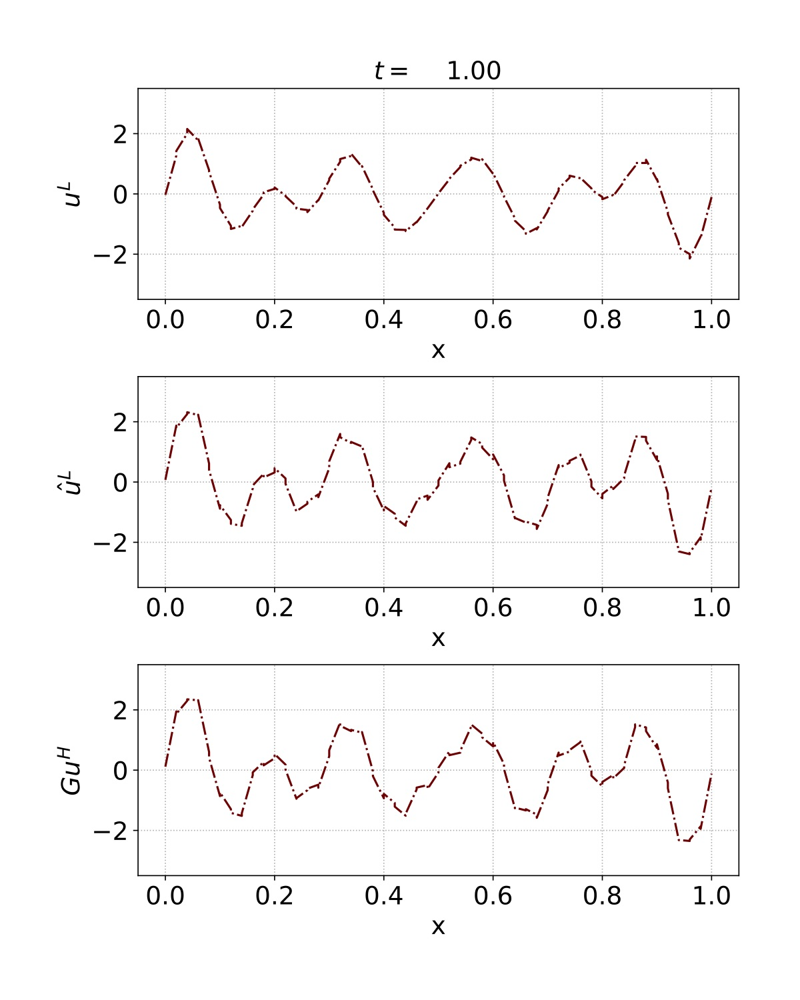
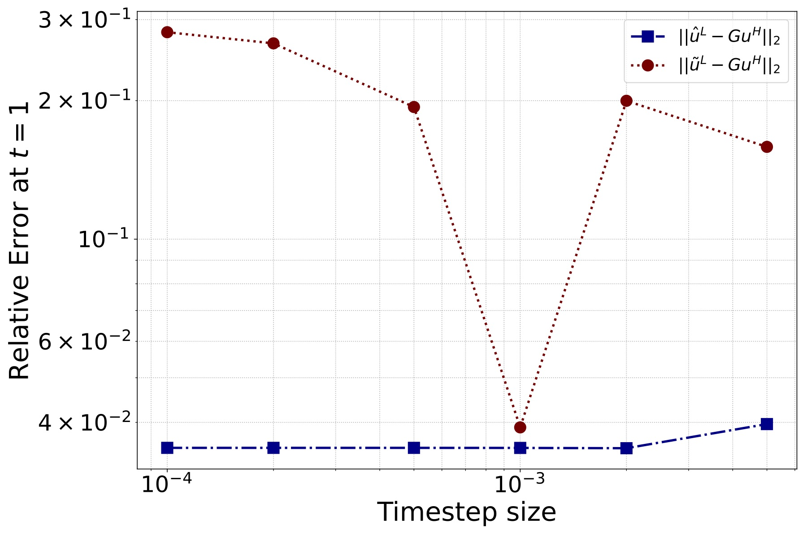
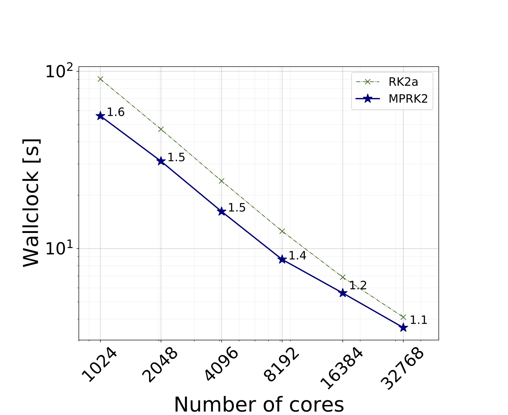
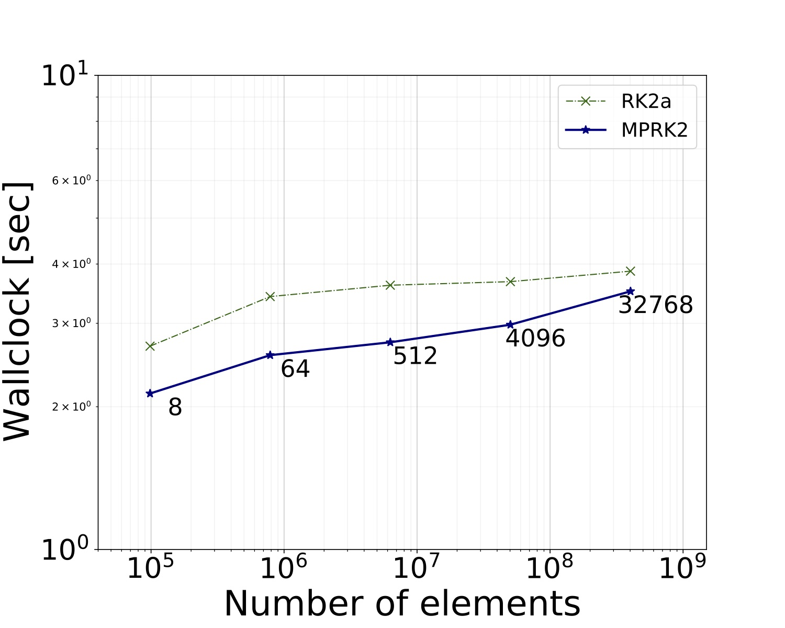
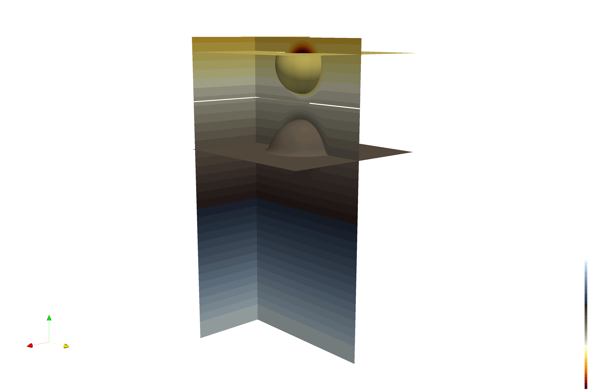
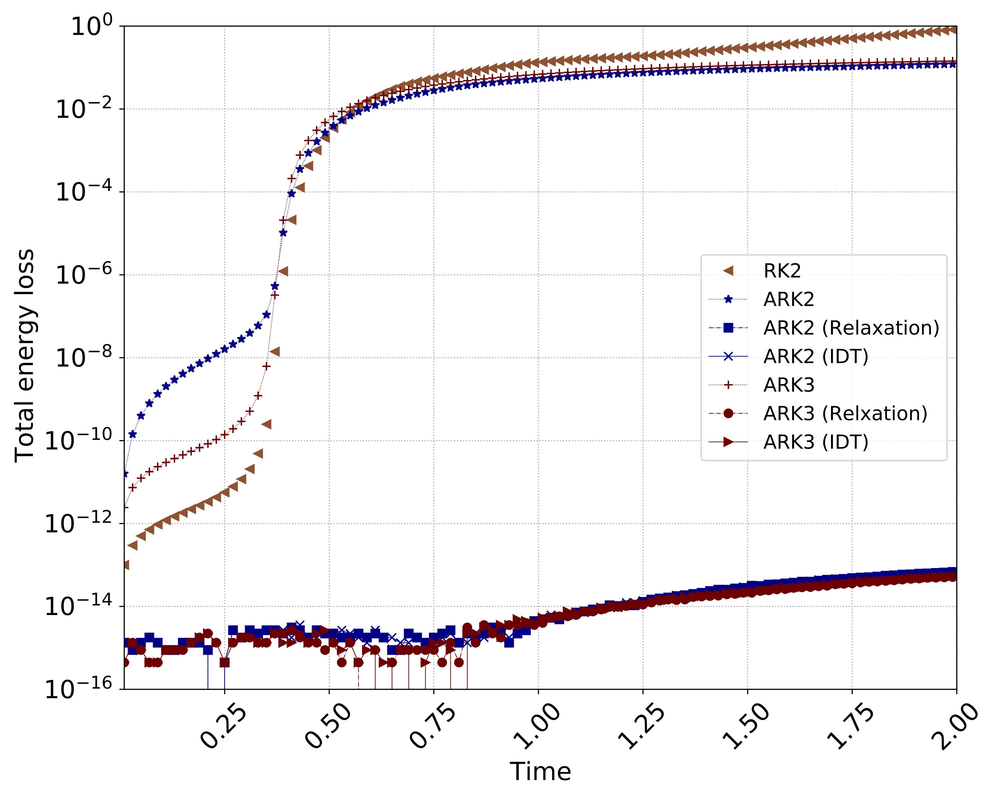

My research focuses on computational mechanics with an emphasis on fluid dynamics. To solve complex multiscale and multiphysics problems, scientific computing and high-performance computing are of interest. Nowadays, I also concentrate on enhancing computational fluid dynamics with machine learning.

<!-- I enjoy working with engineers, computerscientists, mathematicians and others. Interacting with them allows me to see my problems fromdifferent perspectives, which inspire new ideas, overcome difficulties that arise in research, and improve the quality of my research work. -->

<!-- My research primarily focuses on numerical methods for partial differential equations.
This includes high-order spatial and temporal discretization methods
such as (hybridized) discontinuous Galerkin (DG), 
finite volume (FV), exponential integrators, multirate methods, and implicit-explicit (IMEX) methods. 
Developing scalable numerical algorithms for modern computer architectures is also of interest.
Recent work is to 
develop stable time stepping schemes for coupling multiphysics systems, e.g., atmosphere and ocean.
 -->

# Research Highlights

- [Learning Subgrid-scale Models with Neural Ordinary Differential Equations](#learning-sgsmodel-node)
- [Multirate Partitioned Runge-Kutta Methods for Coupled Navier--Stokes Equations](#multirate-coupling-methods)
- [Entropy-Conserving/Stable Partitioned Runge-Kutta Methods](#entropy-stable-imex-and-multirate-methods)
- [Mass-Conserving IMEX Coupling](#mass-conserving-imex-coupling)
- [Scalable Time Integrators](#exponential-dg)
- [High-order Spatial Discretizations](#hybridized-dg-methods-for-a-linear-degenerate-elliptic-equations)
- [Geophysical Flows](#a-coupled-implicit-hdg-and-explicit-dg-methods-for-shallow-water-systems)
- [Remote Sensing](#temperature-and-moisture-retrievals-from-hyperspectral-measurements)

## Learning Subgrid-scale Models with Neural Ordinary Differential Equations
 
In this study we leverage neural ordinary differential equations (NODEs) and simulation data with different scales to learn the dynamics of the source term at a continuous level. 
Our approach inherits the benefits of NODEs and has the potential to be applicable to various parameterization problems. 
The contributions of our work are summarized as follows:
(1) we propose a novel approach to learn continuous source dynamics through neural ordinary differential equations; (2) we numerically demonstrate that the neural network source operator is capable of approximating coupling terms as well as reconstructing the subgrid-scale dynamics; and  
(3) we generalize the discrete corrective forcing approach (Lara and Ferror, 2022) to a continuous corrective forcing approach that supports high-order accuracy in time, and we compare the two methods. 
Indeed, the numerical examples confirm that our proposed approach is insensitive to changing the timestep size. In particular, the prediction with continuous corrective forcing term shows a convergent behavior to the filtered solution with decreasing  timestep size. We also numerically demonstrate that our proposed approach performs better than the discrete corrective forcing approach in terms of accuracy. 

Hovm\"{o}ller diagram of the true model (top) and the trained model (middle) for the slow variables of two-scale Lorenz 96 system. The bottom panel shows the difference between the two simulations.

We show the snapshot of $u^L$, $\hat{u}^L$, and $Gu^H$ at the final time ($t=1$). We note that the neural network source term helps maintain a less smooth (polygonal) waveform of the filtered solution, when compared with the first-order DG method without the source term.

The following figure shows the relative errors of $\hat{u}^L$ (red dot line) and $\tilde{u}^L$  (blue dash dot line)  against timestep sizes. In general the continuous corrective forcing approach demonstrates  better accuracy than the discrete corrective forcing approach. The error of $\hat{u}^L$ converges to a certain nonzero constant with decreasing $\triangle t^L$.
The error of $\tilde{u}^L$, however, does not show any convergence; rather, it has the minimum relative error at $\triangle t^L=10^{-3}$ in which discrete corrective forcing was trained. 

This is expected because the discrete corrective forcing approach learns a map from the low-order solution to the corrective forcing approximation with a specific timestep size and the first-order Euler method. Thus, predicting with different $\dt_L$ results in poor performance. 
On the other hand, the neural ODE approach learns the corrective forcing operator at a continuous level. This leads to consistent results that do not degrade the simulation predictability by changing the timestep size

- [Learning Subgrid-scale Models with Neural Ordinary Differential Equations](https://arxiv.org/pdf/2212.09967.pdf)

## Multirate Coupling Methods
 
we propose to apply multirate partitioned Runge-Kutta (MPRK) coupling methods for fluid-fluid interaction problems. 
We propose using multirate partitioned Runge-Kutta (MPRK) coupling methods for fluid-fluid interaction problems. 
A buffer region is employed at the interface to ensure a smooth transition, which is essential for conservation and convergence. 
Our solution adds only a little amount of complexity to a singlerate implementation while providing the complete computational benefit of a multirate method. 
We develop a theoretical performance model for both serial and parallel instances to measure computing performance systematically. 
The usefulness of using multirate methods for solving coupled compressible Navier-Stokes equations (CNS) has been demonstrated through several numerical studies. 

We perform the simulation with the MPRK2 ($m=4$) method.
The evolution of temperature fields is shown for $t\in\{0,2000\}$. 
The cold fluid parcel in the atmosphere drops down to the interface while the warm fluid in the ocean rises. The cold and warm perturbations horizontally move balancing heat and momentum fluxes across the interface, and hit the walls. 
The cooled fluid on the ocean surface begins to sink and create circulations. 

We also studied the parallel performance of the MPRK2 method using three-dimensional coupled compressible Navier-Stokes equations. 
Thanks to its explicit nature, the MPRK2 coupling method shows favorable strong and weak scaling results 
 

for the thermal convection example. 

<!--  -->
<!--  -->
<!--  -->
<!--  -->

- [Multirate Partitioned Runge-Kutta Methods for Coupled Navier--Stokes Equations](https://arxiv.org/pdf/2202.11890.pdf)

## Entropy Stable IMEX and Multirate Methods
 
we present entropy-stable time discretization methods by using a relaxation method for partitioned Runge-Kutta schemes. In particular we apply relaxation to IMEX-RK methods to solve stiff problems and to a class of explicit second-order multirate methods with grid-induced stiffness. The relaxation methods successfully extend to both the IMEX-RK and multirate methods for targeting stiff problems in combination with an entropy-conserving/stable spatial discretization. 

In particular, we focus on relaxation IMEX-RK methods on a uniform mesh to tackle scaleseparable stiffness. This is achieved by defining the linearized flux containing the fast wave in the system with the stiffness being implicitly treated, thus allowing for a longer time step size than that restricted by explicit methods. In addition, relaxation IMEX-RK methods not only support high-order accuracy in time but also have entropy-conserving/stable properties if entropy-conserving/stable fluxes are equipped with them.

We have also studied the multirate method on a nonuniform mesh to handle geometric-induced stiffness arising from mesh refinements. Unlike IMEX-RK methods, multirate methods do not require any linear/nonlinear solve and, hence, are attractive for parallel computing if proper preconditioning is not available. Multirate methods decompose the original problem into subproblems, where different time step sizes can be used locally on each subproblem. We have numerically demonstrated that the Relaxation-MRK2 method has a second-order rate of convergence and shows the total entropy-conserving/stable behavior if entropy-conserving/stable spatial discretization is provided.

- [Entropy-Preserving and Entropy-Stable Relaxation IMEX and Multirate Time-Stepping Methods](https://arxiv.org/pdf/2108.08908.pdf)

## Mass Conserving IMEX Coupling

Earth system models are composed of coupled components that separately model systems such as the global atmosphere, ocean, and land surface. While these components are well developed, coupling them in a single system can be a significant challenge. Computational efficiency, accuracy, and stability are principal concerns. In this study we focus on these issues. In particular, implicit-explicit (IMEX) tight and loose coupling strategies are explored for handling different time scales. For a simplified model for the air-sea interaction problem, we consider coupled compressible Navier–Stokes equations with an interface condition. Under the rigid-lid assumption, horizontal momentum and heat flux are exchanged through the interface.

IMEX coupling methods solve one domain explicitly and the other implicitly. To enhance computation efficiency, we adapt IMEX time integrators, which can handle scale-separable stiffness or geometrically induced stiffness, as an implicit solver. Furthermore, we employ a horizontally explicit and vertically implicit (HEVI) approach where solutions are obtained column by column; hence, the resulting linear system is significantly reduced compared with two-dimensional IMEX methods.

We conduct the simulation with the IMEX method. The evolution of temperature fields is shown for $t \in [0,500]$. 
Kelvin-Helmholtz waves are well developed at $t=100$ and start to diffuse while mixing fluids. 
Meanwhile, because of the heat and horizontal momentum exchange, fluid on the bottom domain cools near the interface and moves along the outside of vortex as time passes.

Total mass is conserved with IMEX coupling methods regardless of tight or loose coupling methods. The total mass losses for IMEX tight and loose coupling methods are within $\mathcal{O}(10^{−13})$. This result makes sense because we do not exchange the mass across the interface but adjust the wall temperature in the interface. This rigid-lid condition blocks the vertical motion of the interface: no mass flux is allowed, and hence the total mass is conserved. As for the total energy loss, a peak is observed near $t=100$ (when strong KHI is observed above), and then the total energy loss decreases as time passes.

<!-- - [Mass-Conserving Implicit-Explicit Methods for Coupled Compressible Navier-Stokes Equations](https://arxiv.org/abs/2101.09263) -->
- [Mass-Conserving Implicit-Explicit Methods for Coupled Compressible Navier-Stokes Equations](https://doi.org/10.1016/j.cma.2021.113988)

## Exponential DG
 
We propose an Exponential DG approach for numerically solving partial differential equations (PDEs). The idea is to decompose the governing PDE operators into linear (fast dynamics extracted by linearization) and nonlinear (the remaining after removing the former) parts, on which we apply the discontinuous Galerkin (DG) spatial discretization. The resulting semi-discrete system is then integrated using exponential time-integrators: exact for the former and approximate for the latter. 

By construction, our approach is stable with a large Courant number (Cr > 1); supports high-order solutions both in time and space; is computationally favorable compared to IMEX DG methods with no preconditioner; and requires comparable computational time compared to explicit RKDG methods.

   
Exponential DG approach is scalable in a modern massively parallel computing architecture by exploiting Krylov-subspace matrix-free exponential time integrators and compact communication stencil of DG methods. 
The following plot shows good strong scalability up to 41664 cores (the maximum number of cores in Skylake system in [TACC](https://www.tacc.utexas.edu)). An isentropic vortex is simulated for three-dimensional Euler equations. 
 

<!-- - [A scalable exponential-DG approach for nonlinear conservation laws: with application to Burger and Euler equations](https://arxiv.org/abs/2011.01316) -->
- [A scalable exponential-DG approach for nonlinear conservation laws: with application to Burger and Euler equations](https://doi.org/10.1016/j.cma.2021.114031)

## Hybridized DG methods for a Linear Degenerate Elliptic Equations

We develop a high-order hybridized discontinuous Galerkin (HDG) method for a linear degenerate elliptic equation arising from a two-phase mixture of mantle convection or glacier dynamics. 
Both phenomena can be described by a two-phase mixture model, in which the mixture of the fluid and the solid is described by the porosity $\phi$(i.e., $\phi>0$ implies the fluid-solid two-phase and $\phi=0$ means the solid single-phase region). The challenge is when the porosity vanishes because the system degenerates, which make the problem difficult to solve numerically.
We start by scaling variables to obtain the well-posedness. 
Then we spatially discretize the system using the upwind HDG framework. 

Below shows the contours of the physical pressure $\tilde{p}$ and 
the scaled pressure $p$. We observe that the pressure $\tilde{p}$ changes 
smoothly in the two-phase regions, but abruptly becomes zero 
in the one-phase region. The sudden pressure jump on the intersection 
is alleviated with the use of the scaled pressure $p$.

We have modified the upwind HDG flux to accommodate the degenerate (one-phase) region. When the porosity vanishes, the unmodified HDG system becomes ill-posed because the stabilization parameter associated with the HDG flux disappears. To handle this, we introduce the generalized stabilization parameter that is composed of the upwind based parameter in the two-phase region and a positive parameter in the one-phase region. This enabled us to develop a high-order HDG method for a linear degenerate elliptic equation.
For the degenerate case with a smooth solution, the convergence rate of 
$k + \frac{1}{2}$ is observed for the scaled pressure $p$. We can further enhance the HDG solutions in smooth-regions by post-processing. The post-processed pressure $p^\star$ converges to the true solution 
with the rate of $k + \frac{3}{2}$. 

- [A hybridized discontinuous Galerkin method for a linear degenerate elliptic equation arising from two-phase mixtures](https://doi.org/10.1016/j.cma.2019.03.018)

## A Coupled Implicit HDG and Explicit DG methods for Shallow Water Systems

We propose IMEX HDG-DG schemes for planar and spherical shallow water systems.
Of interest is subcritical flow, 
where the speed of the gravity wave is faster than that of nonlinear advection.
In order to simulate these flows efficiently,
 we split the governing system into a stiff part describing the gravity wave
  and a non-stiff part associated with nonlinear advection. 

IMEX HDG-DG approaches are more economical than our previous work on IMEX DG
due to the fewer number of coupled degrees of freedom 
in the context of a direct solver. 
Compared to standard fully implicit methods, 
they are advantageous since only one linear solve is needed for each stage per time-step.
With a low Froude number, 
the IMEX HDG-DG methods can be more economical than the explicit RK 
when the desired accuracy is relaxed.
Below is the summary of temporal convergence study for moving vortex with $Fr=0.01$. 
When the saturation error level is $\mathcal{O}(10^{-6})$, 
ARS2 and ARS3 are six and four times faster than RK2 DG. 

A zonal jet,
a wind field along a latitude line and geostrophically balanced height field, 
is initialized in the northern hemisphere. 
Then, the height field is perturbed by adding a smoothly localized bump 
to the center of the jet, which causes barotropic waves to evolve in time. 
The vorticity field computed from ARS2 HDG-DG is comparable to the [work](https://rmets.onlinelibrary.wiley.com/doi/pdf/10.1002/qj.2474).

- [IMEX HDG-DG: A coupled implicit hybridized discontinuous Galerkin and explicit discontinuous Galerkin approach for shallow water systems](https://doi.org/10.1016/j.jcp.2019.109010)

## Temperature and Moisture Retrievals from Hyperspectral Measurements

An Atmospheric Emitted Radiance Interferometer [(AERI)](https://www.ssec.wisc.edu/aeri/), which measures downwelling radiances, has been in operation at Anmyeon-do, South Korea, since June 2010. 
Temperature and moisture profiles with high temporal and vertical resolution can be retrieved from the measured AERI spectrum through the retrieval algorithm [AERIPROF](https://www.arm.gov/capabilities/vaps/aeriprof).

Below shows the spectra measured by the AERI on 26 May 2010 (case 1) and on 23 March 2011 (case 2). The air temperature at ground level in case 1 ($290.8 K$) was larger than in case 2 ($276.7 K$). Precipitable water vapor (PWV) in case 1 ($2.02 cm$) was higher than in case 2 ($0.38 cm$). The $CO_2$ bands are sensitive to a temperature sounding. The radiances in the $CO_2$ bands are higher in case 1 than in case 2. The transparency of the $H_2O$ bands and the atmospheric window is sensitive to the column water amount. The transparency of the $H_2O$ bands and the atmospheric window bands in case 1 is reduced compared to case 2 counterpart. The two measured spectra show good agreement with the observed temperature and PWV. 

In this work, we improve retrieval performance by adjusting a bias spectrum and regression coefficients for Anmyeon-do. 
The bias spectrum was recomputed from 
the coincident radiosondes during the field experiments and 
regression coefficients were obtained from local radiosondes and associated simulated spectral radiances through principal component analysis (PCA). 
The reduced (a) RMS errors and (b) bias profiles between the radiosondes are observed. The modified statistical regressions show better performance than the original statistical regression in the lower troposphere ($1000–700 hPa$).

- [Improvement of AERI T/q retrievals and their validation at Anmyeon-do, South Korea](https://doi.org/10.1175/jtech-d-12-00029.1)
